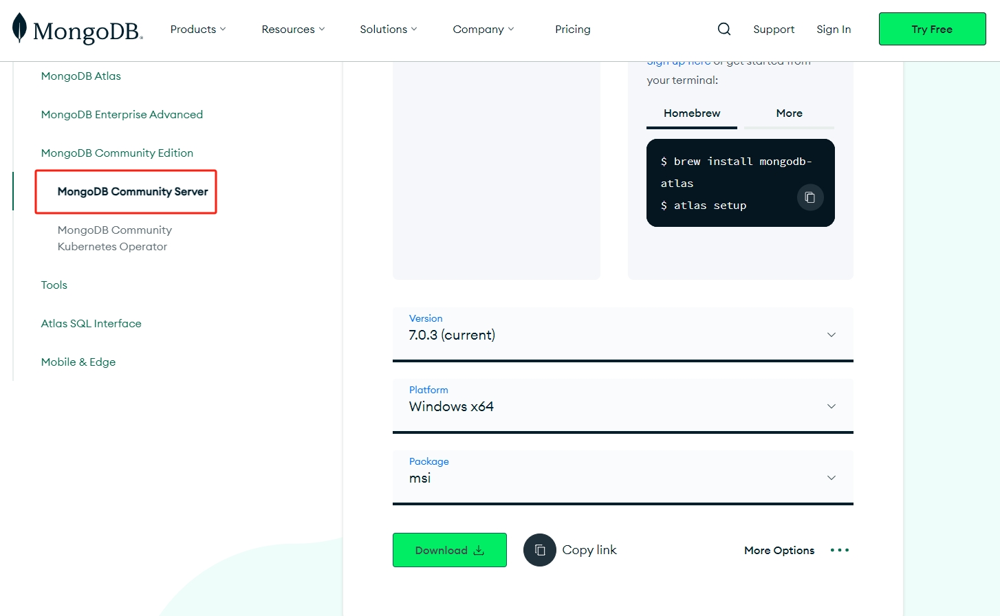
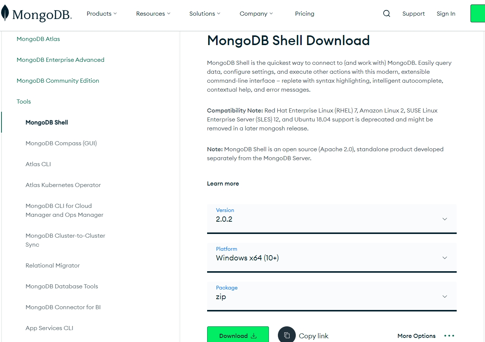

# MongoDB基本概念

## 概念/术语
| SQL         | MongoDB      |                 解释                 |
| ----------- | ------------ | :----------------------------------: |
| database    | database     |                数据库                |
| table       | collection   |               表/集合                |
| row         | document     |               行/文档                |
| column      | field        |               字段/域                |
| table joins |              |        表连接，MongoDB不支持         |
|             | 嵌入document |  MongoDB通过嵌入式文档代替多表连接   |
| primary key | primary key  | 主键，MongoDB自动将_id字段设置为主键 |

## 特点
1. 面向集合存储，易于存储对象类型的数据
2. 模式自由
3. 支持动态查询
4. 支持完全索引，包含内部对象
5. 支持复制和故障恢复
6. 使用高效的二进制数据存储，包括大型对象（如：视频）等
7. 自动处理碎片，以支持云计算层次的扩展性
8. 支持Python、PHP、Ruby、Java、C、C#、JavaScript、Perl、C++语言的驱动程序，社区也提供了对Erlang及.NET等平台的驱动程序
9. 文件存储格式为BSON（一种JSON的扩展）

## 安装
- 下载MongoDB Community Server
  
- 安装时，选择custom安装，自定义安装目录
- `Install MongoDB Compass`不要勾选，安装时间太长了
- 在软件安装目录，需要新建两个文件夹和一个`mongo.config`文件
  1. `data`文件夹，再在`data`下新建`db`文件夹，用于存放数据库
  2. `log` 文件夹，用于存放日志文件
  3. `mongo.config`
    ```bash
     dbpath=D:\Develop\MongoDB\data\db #你的数据库路径
  
     logpath=D:\Develop\MongoDB\log\mongodb.log #日志输出文件路径
  
     logappend=true #错误日志采用追加模式
  
     quiet=true #过滤掉无用的日志信息，若需要调试使用请设置为false
  
     port=27017 #端口号 默认为27017
    ```
- 下载MongoDB Shell，等MongoDB服务启动后可以通过shell来操作数据库
  

## 启动服务
1. 通过命令行启动
  > 打开MongoDB安装目录的`bin`目录，通过`cmd`进入此目录，执行`mongod --dbpath ../data/db`（此时用相对路径，指定数据库的目录；也可以用绝对路径 D:\Develop\MongoDB\data\db），然后在浏览器中输入`http://localhost:27017`，页面显示`It looks like you are trying to access MongoDB over HTTP on the native driver port.`表示服务启动成功
2. 注册服务，通过exe执行文件启动
   1. `计算机-属性-高级系统设置-环境变量-系统变量`，新建一组
      > `变量名：MONGODB_HOME 变量值：D:\Develop\MongoDB (即：你的MongoDB安装的目录)`
   2. 点击 `系统变量-Path`，新建`%MONGODB_HOME%\bin`
3. 现在就可以用bin目录下的 `mongod.exe`启动服务了
   
## 连接MongoDB
1. 打开MongoDB Shell安装目录，`bin`目录下的`mongonsh.exe`，直接回车，默认连接的就是本地的mongo
   > 执行的命令就是：`mongodb://localhost/`
2. [参考链接](https://cloud.tencent.com/developer/article/2212855?areaId=106001)