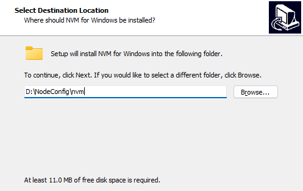
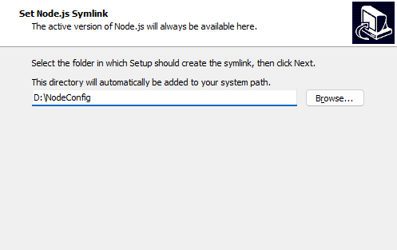
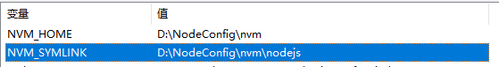
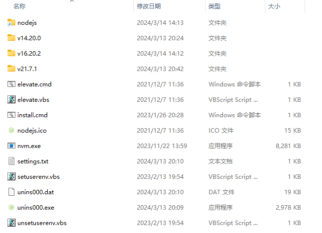
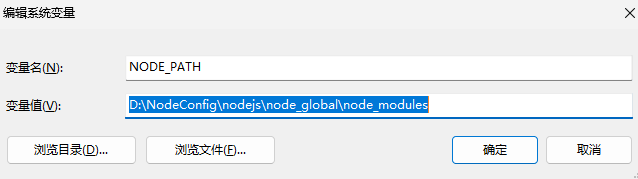
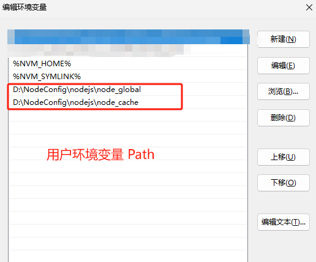

- ## 安装流程
   1. 
   2. 
   3. 这时：`D:\NodeConfig`目录下还没有`nodejs`文件夹，后面使用nvm命令时系统会自动创建；此时需要手动在上一步的路径中加上 `\nodejs`
   4. 安装完成后，在用户环境变量和系统环境变量中都会有`NVM_HOME`和`NVM_SYMLINK`
      
      系统环境变量和用户环境变量的Path中都有：`%NVM_HOME%`和`%NVM_SYMLINK%`

- ## nvm文件夹结构


- ## 在系统环境变量：配置NODE_PATH
   

- ## 配置node的全局安装目录和缓存目录，避免存到C盘下
   1. 在`D:\NodeConfig\nodejs`下，新建两个文件夹，分别为`node_global`和`node_cache`
     
   2. 在命令行执行如下命令，注意路径不要用引号包裹，不然后续使用`npm install`时会找不到路径
      ```bash
      npm config set prefix D:\NodeConfig\nodejs\node_global
      npm config set cache D:\NodeConfig\nodejs\node_cache
      ```