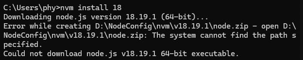
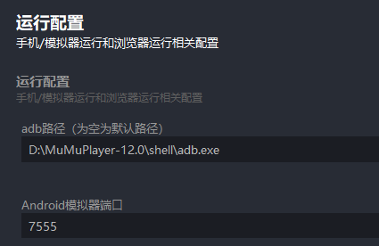

1. ## win11系统，uniapp安装插件失败：检查网络问题和 `nvm install 18`
  
  > 因为软件的权限不足，需要通过 **以管理员身份** 运行

2. ## uniapp开发：运行到模拟器中，需要的配置
   - 打开 “工具-设置-运行配置”
   
   - 运行MuMu模拟器
   - 在adb目录执行命令：`.\adb connect 127.0.0.1:7555`
   - 在HbuilderX点击：运行到手机或模拟器
  
3. ## socket.io-client
  ```js
    const socket = io('wss://localhost:3000', {
      path: `/ws/${123}`,
      transports: ['websocket']
    })
    socket.on('connect', () => {
      console.log('connect success', socket.id)
    })
    socket.on('message', message => {
      console.log(message)
    })
    socket.on('connect_error', error => {
      console.log(error)
    })
    socket.on('disconnect', (reason, details) => {
      console.log(reason, details)
    })
  ```

4. ## TypeIt
  ```js
    const typedRef = useRef<TypeIt | null>(null)
    const outputRef = useRef<HTMLDivElement>(null)

    useEffect(() => {
      const typedOutput = outputRef.current as HTMLDivElement
      const listEls = document.getElementById('listEl')
      if (typedOutput && listEls) {
        typedRef.current = new TypeIt(typedOutput, {
          strings: Array.from(listEls.children).map(el => el.innerHTML),
          speed: 16,
          loop: false
        }).go()
        return () => {
          typedRef.current?.destroy()
        }
      }
    }, [])
  ```

5. ## pm2 常用命令
  ```js
    // 启动项目
    pm2 start npm --name 'my-project' -- run start --watch --ignore-watch="./node_modules" --cluster

    // 查看所有项目状态
    pm2 list

    // 停止项目：
    pm2 stop my-project

    // 重启项目：
    pm2 restart my-project

    // 删除项目：
    pm2 delete my-project

    // 启动项目日志：
    pm2 logs my-project

    // 停止所有项目
    pm2 stop all

    // 重启所有项目
    pm2 restart all

    // 删除所有项目
    pm2 delete all

  ```

6. ## dayjs 获取时间段
   ```js
    import dayjs from 'dayjs'
    import quarterOfYear from 'dayjs/plugin/quarterOfYear'
    dayjs.extend(quarterOfYear)

    export function getTimeRangeByKey(key) {
      const day = dayjs()
      let start = undefined
      let end = undefined
      if (key === 'today') {
        start = end = day
      }
      if (key === 'yesterday') {
        start = end = day.subtract(1, 'day')
      }
      if (key === 'thisWeek') {
        start = day.startOf('week').add(1, 'day')
        end = day.endOf('week').add(1, 'day')
      }
      if (key === 'lastWeek') {
        const lastWeek = day.subtract(1, 'week')
        start = lastWeek.startOf('week').add(1, 'day')
        end = lastWeek.endOf('week').add(1, 'day')
      }
      if (key === 'thisMonth') {
        start = day.startOf('month')
        end = day.endOf('month')
      }
      if (key === 'lastMonth') {
        const lastMonth = day.subtract(1, 'month')
        start = lastMonth.startOf('month')
        end = lastMonth.endOf('month')
      }
      if (key === 'thisQuarter') {
        start = day.startOf('quarter')
        end = day.endOf('quarter')
      }
      if (key === 'lastQuarter') {
        const lastQuarter = day.subtract(1, 'quarter')
        start = lastQuarter.startOf('quarter')
        end = lastQuarter.endOf('quarter')
      }
      if (key === 'firstHalfYear') {
        start = day.quarter(1).startOf('quarter')
        end = day.quarter(2).endOf('quarter')
      }
      if (key === 'lastHalfYear') {
        start = day.quarter(3).startOf('quarter')
        end = day.quarter(4).endOf('quarter')
      }
      if (key === 'thisYear') {
        start = day.startOf('year')
        end = day.endOf('year')
      }
      if (key === 'lastYear') {
        const lastYear = day.subtract(1, 'year')
        start = lastYear.startOf('year')
        end = lastYear.endOf('year')
      }
      return [start.format('YYYY-MM-DD'), end.format('YYYY-MM-DD')]
    }
   ```

7. ## 进程占用问题
```bash

# 查看哪个进程占用了 8081 端口
Windows: netstat -ano | findstr :8081
Mac: lsof -i :8081

# Windows输出
TCP    0.0.0.0:8081           0.0.0.0:0              LISTENING       12345

# 12345 就是进程的 PID
Windows: taskkill /PID 12345 /F
Mac: kill -9 12345
```